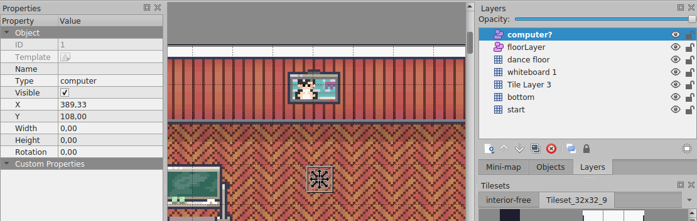
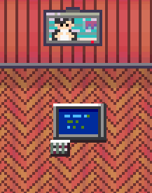

# Reverse Engineering rC3

This document describes what features we found
that are not (yet) documented.

## Objects

Besides sprites and layers it is possible to instantiate
interactive items. At the moment there only seems to exist
one item, namely `"computer"`.

- Items can be interacted with (the computer can be turned on/off)
- Item states are global and persist reloading

To add `"computer"` to your map:

1. create an object layer
2. add a rectangle on that layer where the computer is located
3. change the type of the rectangle to `"computer"`

## Audio

It is possible to play audio, either as a loop or from a file
or web location. This works in a similar way to how websites
are included:

1. create a tile layer
2. create tiles which should have sound
3. add `"playAudio"` with the file name (or URL) as custom property to that layer

